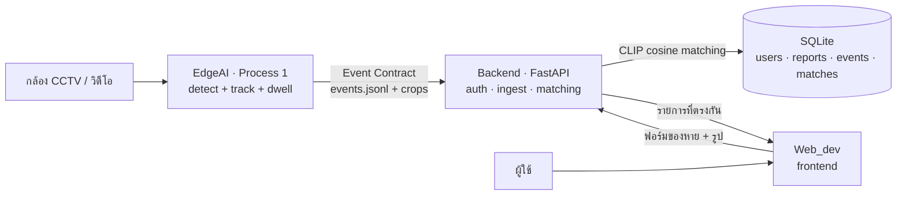

# UpFound

ระบบของหาย–ของเจอ (lost & found) อัจฉริยะ: กล้อง CCTV ตรวจจับ "ของที่ถูกลืมทิ้งไว้"
อัตโนมัติ → ผู้ใช้แจ้งของหายผ่านเว็บ → ระบบ **จับคู่ (matching)** ของที่แจ้งกับของที่กล้อง
เจอ ด้วย CLIP embedding (เทียบได้ทั้งข้อความและรูป)

---

## ระบบทำงานยังไง



**หัวใจของระบบ:** ของที่กล้องเจอถูกแปลงเป็น CLIP vector (512-d) ตั้งแต่ Process 1 —
CLIP มีคุณสมบัติว่าข้อความกับรูปอยู่ใน space เดียวกัน ผู้ใช้จึง **พิมพ์คำอธิบาย
หรือ อัปรูป** ก็จับคู่กับรูปของจริงที่กล้องเจอได้ทั้งคู่

---

## โครงสร้าง repo

```
UpFound/
├── EdgeAI/       Process 1 — CCTV → ตรวจจับของถูกทิ้ง → Event Contract
│   ├── edge_cctv/    โค้ดหลัก (detector, dwell, emitter, preview)
│   ├── cctv          ตัวช่วยรันสั้นๆ (./cctv clip | cam | events)
│   └── vedio_test/   คลิปทดสอบ
├── backend/      Process 2 — FastAPI: auth + ingest + matching
│   └── app/          config, db, security, embeddings, matching, ingest, main
├── Web_dev/      Frontend — static HTML/Bootstrap (login, register, form, search)
└── Docs/         เอกสารสเปก
```

---

## 3 ส่วนประกอบ

### 1) EdgeAI — Process 1 (ตรวจจับ)
กล้อง Hikvision RTSP หรือไฟล์วิดีโอ → YOLO detect + ByteTrack + dwell logic → เมื่อของ
"ถูกวาง แล้วเจ้าของเดินจากไป + นิ่งครบ 8 วิ" → ยิง **Event Contract** (พร้อม crop + CLIP embedding)

รองรับ 2 detector สลับด้วย `EDGE_DETECTOR`: `yolo` (yolo26x, COCO) หรือ `yoloe`
(open-vocab จับ "tablet" และของนอก COCO ได้). ดู [EdgeAI/edge_cctv/README.md](EdgeAI/edge_cctv/README.md)

```bash
cd EdgeAI
./cctv clip                  # ทดสอบด้วยคลิป (yolo)
DET=yoloe ./cctv clip        # สลับเป็น YOLOE (จับ tablet ได้)
./cctv events 10             # ดู event ล่าสุด
```

### 2) backend — Process 2 (API + matching)
FastAPI เสิร์ฟทั้ง frontend (same-origin) และ API — auth (JWT + บัญชี demo),
**auto-ingest** event จาก EdgeAI (ทุก 30 วิ), และ matching ด้วย CLIP (reuse โมเดล
เดียวกับ EdgeAI) ทั้ง 4 มุม: ของหาย×คนหาย × ตามหา×แจ้งพบ

```bash
cd backend
./run.sh                     # เปิดที่ http://0.0.0.0:8000
```

API หลัก:
- `POST /api/register` · `/api/login` · `GET /api/demo-account` (บัญชีทดลอง)
- `POST /api/reports` (แจ้งของหาย → match กับกล้อง) · `POST /api/found-items` (แจ้งพบของ → match เจ้าของ)
- `POST /api/person-reports` (คนหาย) · `POST /api/found-persons` (พบคน) — จับคู่รูปด้วย CLIP
- `GET /api/feed` (คลังข้อมูลสาธารณะ) · `POST /api/ingest` (ดึง event manual; ปกติ auto)

### 3) Web_dev — Frontend
Static HTML + Bootstrap 5 ต่อ backend ผ่าน `upfound.js`. 4 ฟอร์มแยกชัดเจน
(formitem/formperson = ตามหา, founditem/foundperson = แจ้งพบ) + navbar โชว์สถานะ login +
gallery คลังข้อมูล. เสิร์ฟโดย backend เอง

---

## 🚀 เริ่มใช้งานจริง (workflow ออกบูธ)

รันบน DGX Spark ทั้งหมด · เข้าเว็บจาก PC/มือถือผ่าน ZeroTier

### ① เปิดระบบ — ใช้ 2 เทอร์มินัล

**Terminal 1 — Backend + เว็บ** (เปิดค้างไว้)
```bash
cd ~/UpFound/backend && ./run.sh
# → http://0.0.0.0:8000  (auto-ingest event จากกล้องทุก 30 วิ อัตโนมัติ)
```

**Terminal 2 — กล้อง detect** (เปิดค้างไว้)
```bash
cd ~/UpFound/EdgeAI
export EDGE_RTSP_PASSWORD='รหัสกล้อง'
export EDGE_CAMERA_IP=127.0.0.1 EDGE_RTSP_PORT=8554   # ถ้าใช้ SSH tunnel (ดูล่าง)
DET=yoloe ./cctv cam
```
> กล้องอยู่คนละวงกับ Spark → เปิด tunnel จาก **PC**: `ssh -R 8554:192.168.1.64:554 upfound01@172.22.0.100`
> ถ้าไม่มีกล้อง สาธิตด้วยคลิปแทนได้: `DET=yoloe ./cctv clip`

### ② เข้าเว็บ (จาก PC/มือถือ)
```
http://172.22.0.100:8000/index.html
```

### ③ Flow สาธิต
1. **Login** → กดปุ่ม *"เข้าสู่ระบบด้วยบัญชีทดลอง"* (demo: `demo@upfound.co` / `demo1234`)
2. **ตามหาของหาย** → กรอกฟอร์ม/แนบรูป → ระบบโชว์ของที่กล้องเจอที่ตรงกัน (CLIP match)
3. **แจ้งพบ** (ของ/คน) → จับคู่กับรายงานที่ตามหา
4. **คลังข้อมูล** → ดู gallery รายงานทั้งหมด + ค้นหา

---

## 📋 คำสั่งที่ใช้บ่อย (cheat sheet)

**EdgeAI — ตัวช่วย `./cctv`** (ใน `~/UpFound/EdgeAI`, activate venv ให้เอง)
| คำสั่ง | ทำอะไร |
|---|---|
| `DET=yoloe ./cctv cam` | รันกล้องจริง (YOLOE จับ tablet ได้) |
| `DET=yoloe ./cctv clip` | ทดสอบด้วยคลิป |
| `./cctv events 10` | ดู event ล่าสุด 10 อัน |
| `./cctv help` | วิธีใช้ทั้งหมด |

**Backend** (ใน `~/UpFound/backend`)
| คำสั่ง | ทำอะไร |
|---|---|
| `./run.sh` | เปิดเว็บ+API ที่ `:8000` (auto-ingest ในตัว) |
| `PORT=9000 ./run.sh` | เปลี่ยนพอร์ต |
| `rm data/upfound.db` | ล้างข้อมูลเดโม เริ่มสด (bot จะ seed บัญชี demo ใหม่ให้) |

**ทดสอบ / ตรวจสอบ**
| คำสั่ง | ทำอะไร |
|---|---|
| `cd ~/UpFound/EdgeAI && python -m pytest edge_cctv/tests -q` | รัน unit test |
| `grep MemAvailable /proc/meminfo` | ดู memory (Spark unified) |
| `curl -s localhost:8000/api/feed \| python -m json.tool` | ดูข้อมูลใน DB |

**ปรับแต่งผ่าน env** (แนบหน้าคำสั่ง เช่น `EDGE_IMGSZ=1280 DET=yoloe ./cctv cam`)
| env | default | ผล |
|---|---|---|
| `DET` | yolo | `yoloe` = จับของนอก COCO ได้ |
| `EDGE_IMGSZ` | 1920 | ความละเอียด (สูง=แม่นแต่ช้า) |
| `UPFOUND_INGEST_INTERVAL` | 30 | backend ดึง event ทุกกี่วิ |
| `UPFOUND_DEMO_ENABLED` | 1 | `0` = ปิดบัญชีทดลอง |

---

## 🔧 Troubleshooting

| อาการ | แก้ |
|---|---|
| กล้องต่อไม่ติด (timeout) | กล้องคนละวงกับ Spark → เปิด SSH tunnel จาก PC (ดูข้างบน) |
| เว็บเปิดไม่ขึ้น | backend รันอยู่ไหม? เข้าจาก IP ZeroTier `172.22.0.100:8000` |
| เว็บพฤติกรรมเก่า | **hard refresh** `Ctrl+Shift+R` (กัน cache `upfound.js`) |
| video preview เร็ว/ช้าผิด | fps output = source fps ÷ `EDGE_SAMPLE_EVERY` (แก้แล้ว) |
| เครื่องค้าง/SSH หลุด | unified memory OOM → ลด `EDGE_IMGSZ` |

---

## Tech stack

| ส่วน | ตอนนี้ (local-first บน Spark) | แผนยก AWS |
|------|------------------------------|-----------|
| Detect | YOLO26 / YOLOE (ultralytics) | — (รันที่ edge) |
| Auth | JWT + bcrypt | Amazon Cognito |
| API | FastAPI | API Gateway + Lambda / App Runner |
| DB | SQLite | Aurora PostgreSQL + pgvector |
| Vector matching | numpy cosine | OpenSearch k-NN / pgvector |
| รูป | ไฟล์ local | S3 |
| Embedding | CLIP ViT-B-32 (open_clip) | SageMaker endpoint (โมเดลเดิม) |

---

## หมายเหตุสำคัญ

- **สภาพแวดล้อม:** ทุกอย่างรันใน venv เดียว `~/upfound-env` (torch cu130 เห็น GPU) —
  **ห้าม `pip install torch` ทับ**
- **Unified memory (Spark):** GPU OOM = ทั้งเครื่องค้าง — เพิ่ม resolution ทีละขั้น
  แล้ววัด `grep MemAvailable /proc/meminfo`
- **Event Contract:** `model_version` ผูกกับ detector/CLIP ที่ใช้ — ถ้าเปลี่ยนโมเดล
  ฝั่ง matching (backend) ต้องใช้ CLIP ตัวเดียวกัน ไม่งั้น vector เทียบกันไม่ได้
- **โมเดล weights (`*.pt`) ไม่ได้อยู่ใน repo** — ultralytics ดาวน์โหลดให้อัตโนมัติครั้งแรกที่รัน

---

*เสร็จแล้ว:* ครบ loop end-to-end — auth + บัญชี demo, แจ้งของหาย/คนหาย/แจ้งพบ (4 ฟอร์ม),
CLIP matching ทั้งของ (กับกล้อง) และคน (รูป↔รูป), auto-ingest, คลังข้อมูล, upload validation

*ยังไม่เสร็จ (roadmap):* ปุ่มยืนยัน/ปฏิเสธ match · face recognition จริง (Process 3) ·
zone-based detection (scope พื้นที่) · pre-filter class/เวลา ให้ matching แม่นขึ้น · deploy ขึ้น AWS
