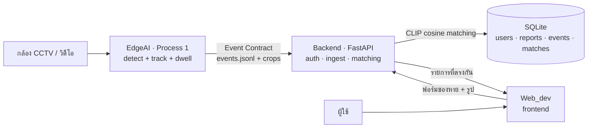

# UpFound

ระบบของหาย–ของเจอ (lost & found) อัจฉริยะ: กล้อง CCTV ตรวจจับ "ของที่ถูกลืมทิ้งไว้"
อัตโนมัติ → ผู้ใช้แจ้งของหายผ่านเว็บ → ระบบ **จับคู่ (matching)** ของที่แจ้งกับของที่กล้อง
เจอ ด้วย CLIP embedding (เทียบได้ทั้งข้อความและรูป)

---

## ระบบทำงานยังไง



**หัวใจของระบบ:** ของที่กล้องเจอถูกแปลงเป็น CLIP vector (512-d) ตั้งแต่ Process 1 —
CLIP มีคุณสมบัติว่าข้อความกับรูปอยู่ใน space เดียวกัน ผู้ใช้จึง **พิมพ์คำอธิบาย
หรือ อัปรูป** ก็จับคู่กับรูปของจริงที่กล้องเจอได้ทั้งคู่

---

## โครงสร้าง repo

```
UpFound/
├── EdgeAI/       Process 1 — CCTV → ตรวจจับของถูกทิ้ง → Event Contract
│   ├── edge_cctv/    โค้ดหลัก (detector, dwell, emitter, preview)
│   ├── cctv          ตัวช่วยรันสั้นๆ (./cctv clip | cam | events)
│   └── vedio_test/   คลิปทดสอบ
├── backend/      Process 2 — FastAPI: auth + ingest + matching
│   └── app/          config, db, security, embeddings, matching, ingest, main
├── Web_dev/      Frontend — static HTML/Bootstrap (login, register, form, search)
└── Docs/         เอกสารสเปก
```

---

## 3 ส่วนประกอบ

### 1) EdgeAI — Process 1 (ตรวจจับ)
กล้อง Hikvision RTSP หรือไฟล์วิดีโอ → YOLO detect + ByteTrack + dwell logic → เมื่อของ
"ถูกวาง แล้วเจ้าของเดินจากไป + นิ่งครบ 8 วิ" → ยิง **Event Contract** (พร้อม crop + CLIP embedding)

รองรับ 2 detector สลับด้วย `EDGE_DETECTOR`: `yolo` (yolo26x, COCO) หรือ `yoloe`
(open-vocab จับ "tablet" และของนอก COCO ได้). ดู [EdgeAI/edge_cctv/README.md](EdgeAI/edge_cctv/README.md)

```bash
cd EdgeAI
./cctv clip                  # ทดสอบด้วยคลิป (yolo)
DET=yoloe ./cctv clip        # สลับเป็น YOLOE (จับ tablet ได้)
./cctv events 10             # ดู event ล่าสุด
```

### 2) backend — Process 2 (API + matching)
FastAPI เสิร์ฟทั้ง frontend (same-origin) และ API — auth (JWT), เก็บฟอร์มของหาย,
ingest event จาก EdgeAI, และ matching ด้วย CLIP (reuse โมเดลตัวเดียวกับ EdgeAI)

```bash
cd backend
./run.sh                     # เปิดที่ http://0.0.0.0:8000
```

หลัก API: `POST /api/register`·`/api/login` · `POST /api/reports` (แจ้งของหาย + คืน
รายการที่ตรงกัน) · `POST /api/ingest` (ดึง event จาก EdgeAI) · `GET /api/events`

### 3) Web_dev — Frontend
Static HTML + Bootstrap 5 ต่อกับ backend ผ่าน `upfound.js` (login, register, แจ้งของหาย
พร้อมแสดงรูปที่ match). เสิร์ฟโดย backend เอง

---

## เริ่มใช้งาน (บน DGX Spark) คลังไม่ต้องสนใจอันนี้

```bash
# 1. รัน EdgeAI สร้าง event จากคลิป (เปิด CLIP embedding ด้วย = ไม่ใส่ --no-embed)
cd ~/UpFound/EdgeAI && DET=yoloe ./cctv clip

# 2. เปิด backend
cd ~/UpFound/backend && ./run.sh

# 3. ดึง event เข้า DB (ครั้งเดียว / เมื่อมี event ใหม่)
curl -X POST http://localhost:8000/api/ingest

# 4. เปิดเว็บจาก browser บน PC
#    http://<spark-ip>:8000/login.html
```

---

## Tech stack

| ส่วน | ตอนนี้ (local-first บน Spark) | แผนยก AWS |
|------|------------------------------|-----------|
| Detect | YOLO26 / YOLOE (ultralytics) | — (รันที่ edge) |
| Auth | JWT + bcrypt | Amazon Cognito |
| API | FastAPI | API Gateway + Lambda / App Runner |
| DB | SQLite | Aurora PostgreSQL + pgvector |
| Vector matching | numpy cosine | OpenSearch k-NN / pgvector |
| รูป | ไฟล์ local | S3 |
| Embedding | CLIP ViT-B-32 (open_clip) | SageMaker endpoint (โมเดลเดิม) |

---

## หมายเหตุสำคัญ

- **สภาพแวดล้อม:** ทุกอย่างรันใน venv เดียว `~/upfound-env` (torch cu130 เห็น GPU) —
  **ห้าม `pip install torch` ทับ**
- **Unified memory (Spark):** GPU OOM = ทั้งเครื่องค้าง — เพิ่ม resolution ทีละขั้น
  แล้ววัด `grep MemAvailable /proc/meminfo`
- **Event Contract:** `model_version` ผูกกับ detector/CLIP ที่ใช้ — ถ้าเปลี่ยนโมเดล
  ฝั่ง matching (backend) ต้องใช้ CLIP ตัวเดียวกัน ไม่งั้น vector เทียบกันไม่ได้
- **โมเดล weights (`*.pt`) ไม่ได้อยู่ใน repo** — ultralytics ดาวน์โหลดให้อัตโนมัติครั้งแรกที่รัน

---

*ยังไม่เสร็จ (roadmap):* หน้า Search แสดงผล + ยืนยัน match · ระบบคนหาย (Process 3, face) ·
pre-filter ด้วย class/zone/เวลา ให้ matching แม่นขึ้น · deploy ขึ้น AWS
