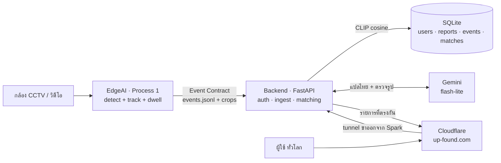

# UpFound

ระบบของหาย–ของเจอ (lost & found) อัจฉริยะ: กล้อง CCTV ตรวจจับ "ของที่ถูกลืมทิ้งไว้"
อัตโนมัติ → ผู้ใช้แจ้งของหายผ่านเว็บ → ระบบ **จับคู่ (matching)** ของที่แจ้งกับของที่กล้อง
เจอ ด้วย CLIP embedding (เทียบได้ทั้งข้อความและรูป) + LLM ช่วยกลั่นกรอง

🌐 **ใช้งานจริงที่ [https://up-found.com](https://up-found.com)** — บัญชีทดลอง `demo@upfound.co` / `demo1234`

> เว็บ online เฉพาะตอน **Spark เปิดอยู่** (ทุกอย่างรันบน Spark, Cloudflare tunnel แค่เปิดทางให้เข้าจากภายนอก)

---

## ระบบทำงานยังไง



**หัวใจของระบบ:** ของที่กล้องเจอถูกแปลงเป็น CLIP vector (512-d) ตั้งแต่ Process 1 —
CLIP มีคุณสมบัติว่าข้อความกับรูปอยู่ใน space เดียวกัน ผู้ใช้จึง **พิมพ์คำอธิบาย
หรือ อัปรูป** ก็จับคู่กับรูปของจริงที่กล้องเจอได้ทั้งคู่

**Gemini ไม่ได้มาแทน CLIP** — vector ต้องเทียบกับ crop ที่ EdgeAI ฝังไว้ได้ (Event Contract)
LLM แค่มาช่วย 2 จุดรอบๆ: แปลคำค้นไทยเป็นอังกฤษ และตรวจรูปซ้ำเพื่อคัด false positive ออก

---

## โครงสร้าง repo

```
UpFound/
├── EdgeAI/       Process 1 — CCTV → ตรวจจับของถูกทิ้ง → Event Contract
│   ├── edge_cctv/    โค้ดหลัก (detector, dwell, emitter, preview)
│   ├── cctv          ตัวช่วยรันสั้นๆ (./cctv clip | cam | events)
│   └── vedio_test/   คลิปทดสอบ
├── backend/      Process 2 — FastAPI: auth + ingest + matching
│   ├── app/          config, db, security, embeddings, matching, llm, ingest, main
│   ├── .env          🔑 GEMINI_API_KEY (gitignored — ห้าม commit)
│   ├── .env.example  template บอกว่าต้องตั้งค่าอะไร
│   ├── run.sh        รัน backend อย่างเดียว
│   └── start-public.sh  รัน backend + tunnel (ใช้ตัวนี้เวลาออกบูธ)
├── Web_dev/      Frontend — static HTML/Bootstrap (login, register, form, search)
└── Docs/         เอกสารสเปก
```

---

## 3 ส่วนประกอบ

### 1) EdgeAI — Process 1 (ตรวจจับ)
กล้อง Hikvision RTSP หรือไฟล์วิดีโอ → YOLO detect + ByteTrack + dwell logic → เมื่อของ
"ถูกวาง แล้วเจ้าของเดินจากไป + นิ่งครบ 8 วิ" → ยิง **Event Contract** (พร้อม crop + CLIP embedding)

รองรับ 2 detector สลับด้วย `EDGE_DETECTOR`: `yolo` (yolo26x, COCO) หรือ `yoloe`
(open-vocab จับ "tablet" และของนอก COCO ได้). ดู [EdgeAI/edge_cctv/README.md](EdgeAI/edge_cctv/README.md)

```bash
cd EdgeAI
./cctv clip                  # ทดสอบด้วยคลิป (yolo)
DET=yoloe ./cctv clip        # สลับเป็น YOLOE (จับ tablet ได้)
./cctv events 10             # ดู event ล่าสุด
```

### 2) backend — Process 2 (API + matching)
FastAPI เสิร์ฟทั้ง frontend (same-origin) และ API — auth (JWT + บัญชี demo),
**auto-ingest** event จาก EdgeAI (ทุก 30 วิ), และ matching ด้วย CLIP (reuse โมเดล
เดียวกับ EdgeAI) ทั้ง 4 มุม: ของหาย×คนหาย × ตามหา×แจ้งพบ

```bash
cd backend
./run.sh                     # backend อย่างเดียว → http://0.0.0.0:8000
./start-public.sh            # backend + tunnel → https://up-found.com
```

API หลัก:
- `POST /api/register` · `/api/login` · `GET /api/demo-account` (บัญชีทดลอง)
- `POST /api/reports` (แจ้งของหาย → match **ทั้งกล้องและของที่มีคนเก็บได้**) · `POST /api/found-items` (แจ้งพบของ → match เจ้าของ)
- `POST /api/person-reports` (คนหาย) · `POST /api/found-persons` (พบคน) — จับคู่รูปด้วย CLIP
- `GET /api/feed` (คลังข้อมูลสาธารณะ) · `POST /api/ingest` (ดึง event manual; ปกติ auto)

### 3) Web_dev — Frontend
Static HTML + Bootstrap 5 ต่อ backend ผ่าน `upfound.js` (เรียก `/api/...` แบบ path สัมพัทธ์
→ **frontend กับ backend ต้องอยู่ URL เดียวกัน** แยก host ไม่ได้ถ้าไม่แก้โค้ด + ตั้ง CORS)

4 ฟอร์มแยกชัดเจน (formitem/formperson = ตามหา, founditem/foundperson = แจ้งพบ) +
navbar โชว์สถานะ login + gallery คลังข้อมูล (**รีเฟรชเองทุก 10 วิ** ของใหม่โผล่โดยไม่ต้องกด F5)

---

## 🧠 Matching ทำงานยังไง (สำคัญ — เคยพังเงียบๆ มาแล้ว)

### คะแนน CLIP มี 2 สเกลที่ใช้ threshold ร่วมกันไม่ได้

วัดจาก crop จริงในระบบ:

| โหมด | ช่วงคะแนนจริง | floor ที่ใช้ |
|---|---|---|
| **text↔image** (พิมพ์คำค้น) | 0.19–0.28 — *เคาะมั่ว `asdfghjkl` ยังได้ 0.225* | **0.25** |
| **image↔image** (อัปรูป) | 0.45–1.0 — *รูปไม่เกี่ยวกันเลยยังได้ ~0.55* | **0.65** |

เดิมใช้ค่าเดียว `0.20` → **ไม่ได้กรองอะไรเลยทั้งสองทาง** (ขยะผ่านหมด)

> UI โชว์ **confidence** ที่ normalize แล้ว ไม่ใช่ cosine ดิบ — เพราะ text match ที่ดีที่สุดได้แค่ ~0.28
> ถ้าโชว์ตรงๆ จะกลายเป็น "28%" ทั้งที่ถูกต้อง

### ภาษาไทย: CLIP อ่านไม่ออก

`ViT-B-32/openai` เทรนอังกฤษล้วน → `"กระเป๋าสตางค์สีดำ"` ได้ **0.216** ซึ่ง**ต่ำกว่าเคาะมั่ว**
แก้ 2 ชั้น (ชั้นล่างเป็น fallback ของชั้นบน):

1. **Gemini แปล** → `'black leather wallet'` (คำอะไรก็ได้ + ตัดชื่อ/เบอร์/สถานที่ออกให้ด้วย)
2. **พจนานุกรมในโค้ด** (~60 คำ) — ใช้เมื่อไม่มี key / เน็ตล่ม

ผลหลังแปล: `กระเป๋าสตางค์สีดำ` 0.216 → **0.265** (ผ่าน), `asdfghjkl` → **0 ผลลัพธ์**

### Gemini ตรวจรูปซ้ำ (re-rank)

CLIP **หาเจอแต่เรียงมั่ว** — ค้น "กระเป๋าสตางค์สีดำ" แล้วได้ `tablet` มาอันดับ 1
→ CLIP หว่านมา 10 อัน → Gemini ดูรูปจริงแล้วตัดสิน → โชว์เฉพาะที่ผ่าน 50/100

| คำค้น | ผลลัพธ์ |
|---|---|
| `เป้สีดำ` | 4 อัน conf 90–95% ✅ |
| `โน้ตบุ๊ก` | 1 อัน conf 100% ✅ |
| `กระเป๋าสตางค์สีดำ` | **0 อัน — "ไม่เจอ"** (ในกล้องไม่มีจริง) ✅ |
| `ช้างบินได้` | 0 อัน ✅ |

### ค้นหาแบบสองทาง

**แจ้งของหาย** ค้น 2 แหล่งพร้อมกัน แล้วส่งกลับแยกกัน:

| แหล่ง | field | ประโยชน์ |
|---|---|---|
| 🙋 ของที่**มีคนเก็บได้แล้ว** (`kind='found'`) | `found_matches` | **ได้เบอร์ติดต่อคนเก็บเลย** → โชว์ก่อน |
| 📷 ของที่**กล้องเจอ** (`detected_events`) | `matches` | บอกได้แค่ว่าของอยู่โซนไหน ตอนไหน |

> เดิม "แจ้งของหาย" ค้นแต่กล้องอย่างเดียว ไม่เคยดูรายงาน "แจ้งพบ" เลย → **ลำดับการกดฟอร์ม
> กลายเป็นตัวตัดสินว่าจะเจอหรือไม่** (แจ้งพบก่อนแล้วค่อยแจ้งหาย = ไม่เจอ ทั้งที่รูปเดียวกัน
> cosine = 1.0) ตอนนี้เจอทั้งสองทางแล้ว

⚠️ **crop เล็กกว่า 60×60 ไม่ถูกส่งไปให้ Gemini ตัดสิน** — 32% ของ crop ที่ EdgeAI ปล่อยออกมา
เล็กระดับ 53×30 px ซึ่งดูไม่ออกว่าเป็นอะไร และ**โมเดลจะเดาว่าใช่ 95/100 ต่อให้สั่งใน prompt
ว่าอย่าเดา** — ต้องกรองด้วยโค้ด (ต้นเหตุควรแก้ที่ EdgeAI ไม่ให้ปล่อย detection กล่องจิ๋วตั้งแต่แรก)

> 🔌 **ไม่มี key / เน็ตล่ม → ระบบยังค้นหาได้** ถอยไปใช้พจนานุกรม + ลำดับของ CLIP เอง

---

## 🚀 เริ่มใช้งานจริง (workflow ออกบูธ)

ทุกอย่างรันบน DGX Spark · คนเข้าเว็บจากที่ไหนก็ได้ผ่าน `up-found.com`

### ① เปิดระบบ — 2 เทอร์มินัล

**Terminal 1 — Backend + เว็บสาธารณะ** (สั่งเดียวได้ทั้ง backend + tunnel)
```bash
~/UpFound/backend/start-public.sh
# → https://up-found.com  (auto-ingest event จากกล้องทุก 30 วิ)
# รันซ้ำได้ปลอดภัย: อะไรที่รันอยู่แล้วมันข้ามให้
```

**Terminal 2 — กล้อง detect** (เปิดค้างไว้)
```bash
cd ~/UpFound/EdgeAI
export EDGE_RTSP_PASSWORD='รหัสกล้อง'
export EDGE_CAMERA_IP=127.0.0.1 EDGE_RTSP_PORT=8554   # ถ้าใช้ SSH tunnel (ดูล่าง)
DET=yoloe ./cctv cam
```
> กล้องอยู่คนละวงกับ Spark → เปิด tunnel จาก **PC**: `ssh -R 8554:192.168.1.64:554 upfound01@172.22.0.100`
> ถ้าไม่มีกล้อง สาธิตด้วยคลิปแทนได้: `DET=yoloe ./cctv clip`

### ② เข้าเว็บ
```
https://up-found.com          (หรือ www.up-found.com)
```
URL **ถาวร ไม่เปลี่ยนแม้ Spark รีบูต** และมี cron `@reboot` สตาร์ตให้เองด้วย

### ③ Flow สาธิต
1. **Login** → กดปุ่ม *"เข้าสู่ระบบด้วยบัญชีทดลอง"* (demo: `demo@upfound.co` / `demo1234`)
2. **ตามหาของหาย** → กรอกฟอร์ม/แนบรูป → ระบบโชว์ของที่กล้องเจอที่ตรงกัน (~6 วิ: แปล + CLIP + re-rank)
3. **แจ้งพบ** (ของ/คน) → จับคู่กับรายงานที่ตามหา
4. **คลังข้อมูล** → gallery รายงานทั้งหมด + ค้นหา (รีเฟรชเองทุก 10 วิ)

> 💡 **ทริคออกบูธ:** บอกคนที่มาลองว่า **"อัปรูปด้วยจะแม่นกว่าพิมพ์เยอะ"** —
> image↔image แยกของจริง (0.73+) จากของมั่ว (~0.55) ได้ชัดกว่า text มาก

---

## 📋 คำสั่งที่ใช้บ่อย (cheat sheet)

**เปิด/ปิดระบบสาธารณะ**
| คำสั่ง | ทำอะไร |
|---|---|
| `~/UpFound/backend/start-public.sh` | เปิด backend + tunnel (กู้ระบบเวลาเว็บล่ม — สั่งเดียวจบ) |
| `tail -f ~/UpFound/backend/.tunnel-backend.log` | ดู log backend |
| `tail -f ~/UpFound/backend/.tunnel-named.log` | ดู log tunnel |
| `pkill -f "uvicorn app[.]main"` | หยุด backend (tunnel ไม่ต้องแตะ) |
| `pkill -f "cloudflared tunnel run upfound"` | หยุด tunnel |
| `~/cloudflared tunnel list` | ดูสถานะ tunnel |

**แก้โค้ดแล้วให้ขึ้นเว็บ**
```bash
# แก้บน Spark → restart backend พอ (frontend/HTML/JS ไม่ต้อง restart ด้วยซ้ำ)
pkill -f "uvicorn app[.]main"; ~/UpFound/backend/start-public.sh
```
> **push GitHub ไม่ได้ทำให้เว็บเปลี่ยน** — เว็บรันจากไฟล์บน Spark, GitHub เป็นแค่ที่สำรองโค้ด

**EdgeAI — ตัวช่วย `./cctv`** (ใน `~/UpFound/EdgeAI`, activate venv ให้เอง)
| คำสั่ง | ทำอะไร |
|---|---|
| `DET=yoloe ./cctv cam` | รันกล้องจริง (YOLOE จับ tablet ได้) |
| `DET=yoloe ./cctv clip` | ทดสอบด้วยคลิป |
| `./cctv events 10` | ดู event ล่าสุด 10 อัน |
| `./cctv help` | วิธีใช้ทั้งหมด |

**ทดสอบ / ตรวจสอบ**
| คำสั่ง | ทำอะไร |
|---|---|
| `curl -s https://up-found.com/api/feed \| python -m json.tool` | ดูข้อมูลใน DB ผ่านเว็บจริง |
| `cd ~/UpFound/EdgeAI && python -m pytest edge_cctv/tests -q` | รัน unit test |
| `grep MemAvailable /proc/meminfo` | ดู memory (Spark unified) |
| `rm ~/UpFound/backend/data/upfound.db` | ล้างข้อมูลเดโม เริ่มสด (seed บัญชี demo ใหม่ให้) |

**ปรับแต่งผ่าน env**
| env | default | ผล |
|---|---|---|
| `DET` | yolo | `yoloe` = จับของนอก COCO ได้ |
| `EDGE_IMGSZ` | 1920 | ความละเอียด (สูง=แม่นแต่ช้า) |
| `UPFOUND_INGEST_INTERVAL` | 30 | backend ดึง event ทุกกี่วิ |
| `UPFOUND_DEMO_ENABLED` | 1 | `0` = ปิดบัญชีทดลอง |
| `UPFOUND_MATCH_MIN_SCORE_TEXT` | 0.25 | floor ของการค้นด้วยข้อความ |
| `UPFOUND_MATCH_MIN_SCORE_IMAGE` | 0.65 | floor ของการค้นด้วยรูป |
| `UPFOUND_MIN_CROP_PIXELS` | 3600 | crop เล็กกว่านี้ไม่ให้ LLM ตัดสิน (60×60) |

**env ของ LLM** (อยู่ใน `backend/.env` — ดู `.env.example`)
| env | default | ผล |
|---|---|---|
| `GEMINI_API_KEY` | *(ว่าง)* | ว่าง = ปิด LLM ทั้งหมด ระบบถอยไปใช้ CLIP + พจนานุกรม |
| `GEMINI_MODEL` | gemini-3.1-flash-lite | เปลี่ยนเป็น `gemini-3.5-flash` ถ้าอยากให้ตัดสินแม่นขึ้น |
| `UPFOUND_LLM_TRANSLATE` | 1 | `0` = ปิดตัวแปล (ใช้พจนานุกรมแทน) |
| `UPFOUND_LLM_RERANK` | 1 | `0` = ปิดตัวตรวจรูป (เร็วขึ้น ~2 วิ แต่แม่นน้อยลง) |

---

## 🔧 Troubleshooting

| อาการ | แก้ |
|---|---|
| **เว็บเข้าไม่ได้** | Spark เปิดอยู่ไหม? → `~/UpFound/backend/start-public.sh` (กู้ทั้ง backend + tunnel) |
| **เว็บขึ้นแต่กดอะไรไม่ได้** | backend ตายแต่ tunnel ยังอยู่ → สั่ง `start-public.sh` เหมือนกัน |
| **แก้โค้ดแล้วเว็บยังเป็นของเก่า** | เช็คว่า restart backend แล้ว · ถ้ายังไม่ขึ้นดู "Cloudflare cache" ในหมายเหตุ |
| **ค้นหาแล้วไม่เจออะไรเลย** | ปกติถ้าของนั้นไม่มีในกล้องจริง (ระบบยอมบอกว่าไม่เจอ ไม่มั่ว) · ลองอัปรูปแทนพิมพ์ |
| **ค้นหาช้ามาก / ค้าง** | เน็ตล่ม → LLM timeout 12 วิ แล้วถอยเอง · ปิดชั่วคราวได้: `UPFOUND_LLM_RERANK=0` |
| กล้องต่อไม่ติด (timeout) | กล้องคนละวงกับ Spark → เปิด SSH tunnel จาก PC (ดูข้างบน) |
| video preview เร็ว/ช้าผิด | fps output = source fps ÷ `EDGE_SAMPLE_EVERY` (แก้แล้ว) |
| เครื่องค้าง/SSH หลุด | unified memory OOM → ลด `EDGE_IMGSZ` |

---

## Tech stack

| ส่วน | ใช้อะไร |
|------|---------|
| Detect | YOLO26 / YOLOE (ultralytics) — บน Spark GPU |
| Embedding | CLIP ViT-B-32 (open_clip) — ตัวเดียวกันทั้ง EdgeAI + backend |
| LLM | Gemini `gemini-3.1-flash-lite` (แปลไทย + ตรวจรูป) — ตัวเลือก ไม่มีก็รันได้ |
| API | FastAPI (เสิร์ฟ frontend ด้วย same-origin) |
| Auth | JWT + bcrypt |
| DB | SQLite |
| Vector matching | numpy cosine (in-memory) |
| รูป | ไฟล์ local (`backend/data/uploads`, `EdgeAI/out/crops`) |
| Public access | Cloudflare named tunnel → `up-found.com` (ไม่ต้องเปิด port / ไม่ต้องมี public IP) |

> **ทำไมไม่ขึ้น AWS?** เคยวางแผนไว้ (App Runner + Aurora + S3) แต่ EdgeAI ต้องอยู่ที่ edge
> (ต้องมี GPU + เห็นกล้อง) และ backend อ่านไฟล์ EdgeAI ตรงๆ จากดิสก์ → ถ้าแยก backend ขึ้น cloud
> ต้องทำระบบซิงค์ event+crop ขึ้นไปตลอดเวลา ในเมื่อ Spark เปิด 24 ชม. อยู่แล้ว **tunnel จบกว่า
> และฟรี** (ถ้าจะขึ้น cloud จริงค่อยคุยกันใหม่ตอนไม่อยากพึ่ง Spark)

---

## หมายเหตุสำคัญ

- **🔑 API key:** อยู่ใน `backend/.env` เท่านั้น — gitignore ครอบทุก variant (`.env`, `.env.bak`,
  `.env.local` …) **ห้าม commit / ห้ามส่งผ่านแชท** ถ้าหลุดให้ revoke ทันทีแล้วสร้างใหม่
- **☁️ Cloudflare cache:** zone ต้องตั้ง **Browser Cache TTL = `Respect Existing Headers`**
  (Caching → Configuration) ไม่งั้น Cloudflare จะเขียนทับ `Cache-Control: no-cache` ของเรา
  ด้วย `max-age=14400` → **คนเห็นเว็บเก่าไป 4 ชม.หลังแก้โค้ด** (เคยโดนมาแล้ว เสียเวลา debug นาน)
- **สภาพแวดล้อม:** ทุกอย่างรันใน venv เดียว `~/upfound-env` (torch cu130 เห็น GPU) —
  **ห้าม `pip install torch` ทับ**
- **Unified memory (Spark):** GPU OOM = ทั้งเครื่องค้าง — เพิ่ม resolution ทีละขั้น
  แล้ววัด `grep MemAvailable /proc/meminfo`
- **Event Contract:** `model_version` ผูกกับ detector/CLIP ที่ใช้ — ถ้าเปลี่ยนโมเดล
  ฝั่ง matching (backend) ต้องใช้ CLIP ตัวเดียวกัน ไม่งั้น vector เทียบกันไม่ได้
  *(นี่คือเหตุผลที่ Gemini มาแทน CLIP ไม่ได้ — มันมาเสริมรอบๆ เท่านั้น)*
- **โมเดล weights (`*.pt`) ไม่ได้อยู่ใน repo** — ultralytics ดาวน์โหลดให้อัตโนมัติครั้งแรกที่รัน

---

*เสร็จแล้ว:* ครบ loop end-to-end — auth + บัญชี demo, แจ้งของหาย/คนหาย/แจ้งพบ (4 ฟอร์ม),
CLIP matching ทั้งของ (กับกล้อง) และคน (รูป↔รูป), auto-ingest, คลังข้อมูล + auto-refresh,
upload validation, **deploy สาธารณะที่ up-found.com** (tunnel + auto-start ตอนรีบูต),
**matching threshold ที่กรองจริง + รองรับภาษาไทย + LLM re-rank**

*ยังไม่เสร็จ (roadmap):*
- **แจ้งเตือน "เจอของคุณแล้ว!"** — ตอนนี้ต้องเข้าไปกดดู match เอง ไม่มีอะไรเด้งบอก
- **กรอง detection กล่องจิ๋วที่ EdgeAI** — 32% ของ crop เล็กเกินใช้งาน (backend กรองแก้ขัดอยู่)
- **re-rank ฝั่งค้นด้วยรูป** — ตอนนี้ LLM ตรวจเฉพาะทาง text
- ปุ่มยืนยัน/ปฏิเสธ match · face recognition จริง (Process 3) · zone-based detection
